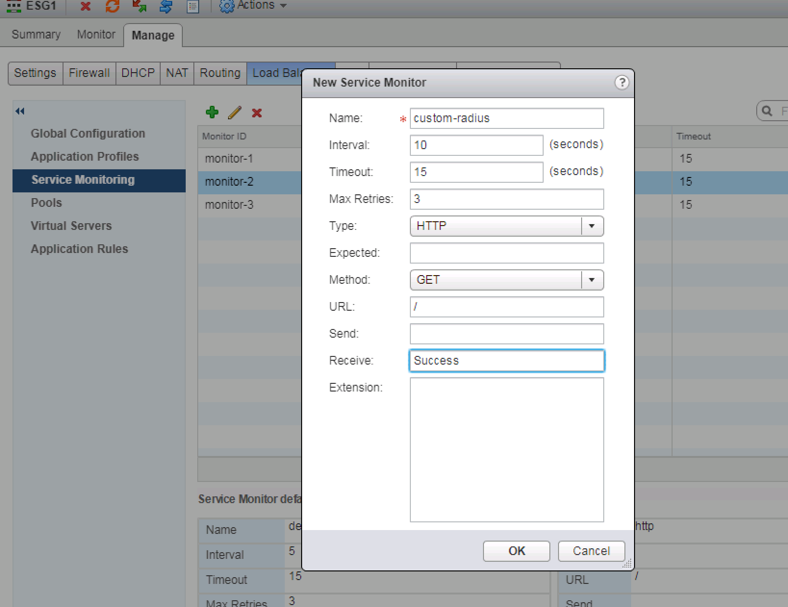
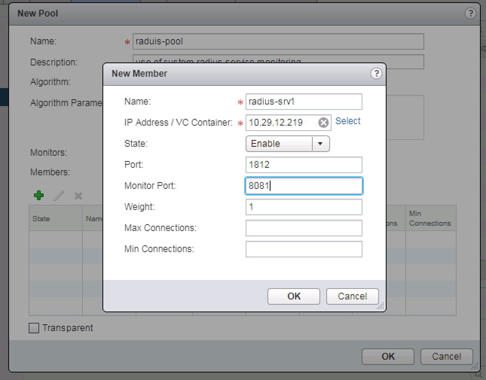

# radius-lb-health-monitor

#### Table of Contents

1. [Description](#description)
1. [Setup - The basics of getting started with nsxt](#setup)
    * [Install](#Install)
    * [Configure](#Configure)
1. [Usage](#usage)
1. [Limitations)
1. [Development](#development)

## Description

Script that checks the health status of an RADIUS server in order to provide feedback to a LB healthcheck
Be aware neither me or VMware provide support for this. It is to help customers do it by themself.

## Setup

### Install

First configure user/password in your RADIUS server. If you want to run the script un-modified you can configure username nsx-lb-test with password VMware1!.
It also runs with the Freeradius default secret for local host which is testing123.
You can test if the your user authenticates correctly with:
```
radtest nsx-lb-test VMware1! 127.0.0.1 0 testing123
```
you need to get a reponse like this:
```
rad_recv: Access-Accept packet from host 127.0.0.1 port 1812, id=60, length=20
```
if it is Access-Reject you need to find out why you cannot authenticate.

Installing dependancies:
```
apt-get -y install python-pip python-daemon
pip install --upgrade pip
pip install py-radius

git clone https://github.com/yasensim/radius-lb-health-monitor.git
```


### Configure
```
cd radius-lb-health-monitor
```
Edit radius-lb-health.py
You need to only edit between lines 25 and 30
Set
``` 
RAD_SECRET = "testing123" - this comes by default with freeradius for authenticating from localhost. You need to change it.
RAD_USER = "nsx-lb-test" - This is the username that we will be trying to authenticate with.
RAD_PASS = "VMware1!" 
HTTP_PORT = 8081 - This is the HTTP port on which the script will listen for HTTP GET from the LoadBalancer. You can change it if 8081 is used.
```

## Usage

Once you ensure you can authenticate with the user, password and secret configured within the script you can run it 
```
python radius-lb-health.py
```
The command above will run it as a daemon. You can validate using ps -fax

Configure custom HTTP service monitor with Receive string: Success
You can fine tune the timers if it is too slow for you.


Specify the value for monitor port that you have configured in the script as HTTP_PORT (8081 by default)




The script produces log message for every health monitor probe with detailed output.
you can follow it here:
```
tail -f /var/log/nsx-lb-healthcheck.log
```

## Limitations

Currently I assume your RADIUS server does not require challenge/response. It is relevantly easy to be implemented. Please open a github issue if you need me to add it for you.

## Development
TBD

